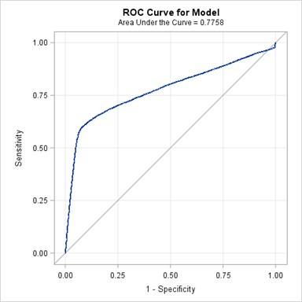
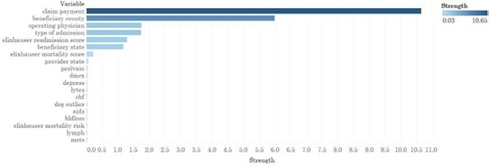
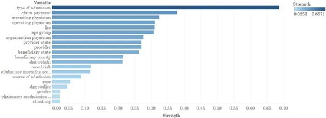
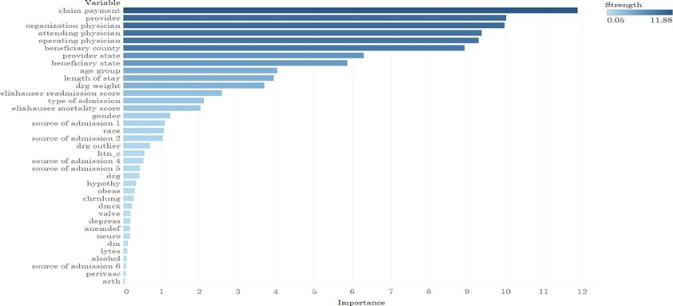
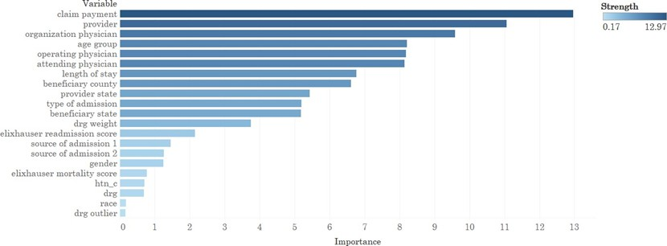
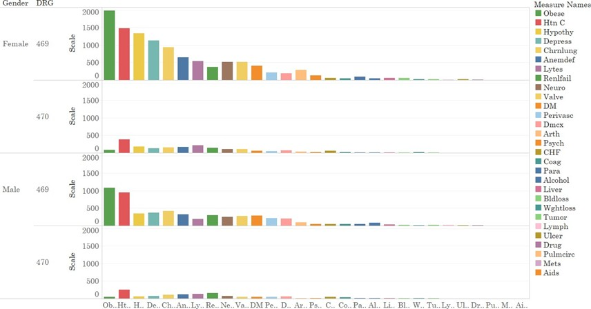
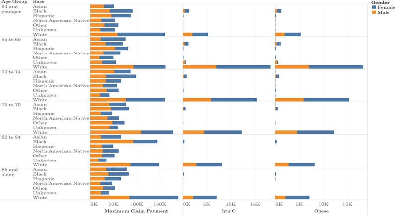
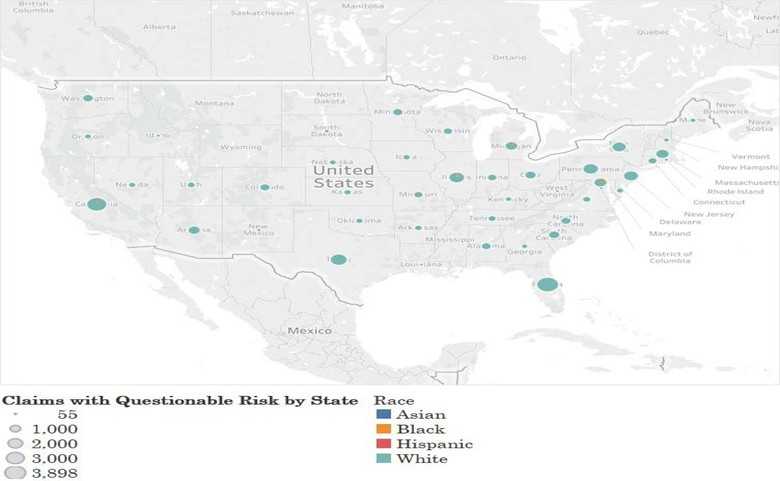

# medicare-claims-ml


Healthcare machine learning research portfolio focused on predictive modeling using Medicare inpatient claims data for Major Joint Replacement or Reattachment of Lower Extremity (DRG 469/470).

---

# Research Overview

This research explored predictive modeling approaches using approximately 2.3 million Medicare inpatient claims records. The study focused on identifying predictors associated with readmissions, mortality, emergency department utilization, and healthcare risk outcomes using supervised machine learning techniques and healthcare analytics.

The research incorporated SAS Enterprise Miner, MATLAB, MLJAR, and Tableau to develop predictive models, evaluate algorithm performance, visualize healthcare trends, and analyze large-scale Medicare claims data.

---

# Technologies

- SAS
- SAS Enterprise Miner
- MATLAB
- Tableau
- MLJAR

---

# Research Areas

- Medicare Claims Analytics
- Predictive Modeling
- Healthcare Machine Learning
- Risk Stratification
- Readmissions Analytics
- Mortality Prediction
- Healthcare Utilization Analytics
- Feature Selection & Model Evaluation

---

# Key Visualizations

## Figure 9. Logistic Regression Results: ROC Curve



---

## Figure 14. NCA Feature Selection Analysis



---

## Figure 18. Predictors Most Involved in Ensemble Boosted Trees Algorithm



---

## Figure 21. Predictors Most Involved in LightGBM Algorithm



---

## Figure 22. Predictors Most Involved in XGBoost Algorithm



---

## Figure 10. Prevalence of Comorbidities by Gender & DRG



---

## Figure 13. Age, Race by Average Medicare Claim Payments within Gender



---

## Figure 25. Claims with Questionable Risk by State & Race



---

# Dissertation Abstract

[Download Dissertation Abstract](abstract/dissertation_abstract.pdf)

---

# Demo Video

[](https://vimeo.com/309895740)

---

# Key Findings

- Ensemble Boosted Trees demonstrated the strongest predictive performance across training and test datasets
- Physicians, providers, claim payment amounts, admission types, and beneficiary geography showed strong predictive importance
- Obesity and hypertension were among the most prevalent comorbidities
- Machine learning models demonstrated strong potential for healthcare surveillance, utilization management, and risk stratification initiatives

---

# Repository Structure

```text
medicare-claims-ml/
│
├── abstract/
│   └── dissertation_abstract.pdf
│
├── charts/
│   ├── demographic_analysis/
│   │   ├── figure10.jpg
│   │   └── figure13.jpg
│   │
│   └── risk_visualizations/
│       └── figure25.jpg
│
├── visuals/
│   ├── roc_curves/
│   │   └── figure9.jpg
│   │
│   ├── feature_importance/
│   │   ├── figure14.jpg
│   │   ├── figure18.jpg
│   │   ├── figure21.jpg
│   │   └── figure22.jpg
│   │
│   └── dashboards/
│
├── demo/
│   └── presentation_video.mp4
│
└── docs/
```